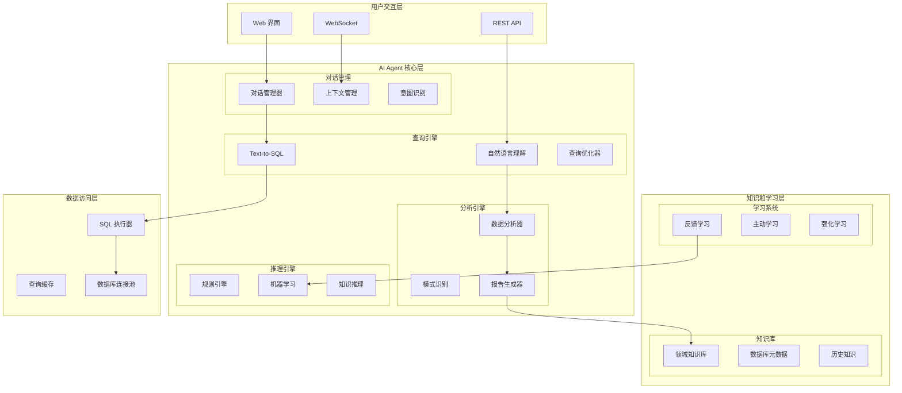

# AI Agent 系统 - 设计文档

## 概述

AI Agent 系统为 SuperInsight 平台提供智能化的数据分析和查询能力。通过集成 Text-to-SQL 引擎、LangChain 框架和人机协作机制，实现自然语言数据查询、智能分析建议和持续学习优化。

## 架构设计

### 系统架构图



### 核心组件设计

#### 1. Text-to-SQL 引擎

**自然语言理解模块:**
```python
from transformers import AutoTokenizer, AutoModel
from langchain.llms import OpenAI
from langchain.chains import LLMChain
from langchain.prompts import PromptTemplate
import torch

class TextToSQLEngine:
    def __init__(self):
        # 加载预训练模型
        self.tokenizer = AutoTokenizer.from_pretrained("microsoft/DialoGPT-medium")
        self.model = AutoModel.from_pretrained("microsoft/DialoGPT-medium")
        
        # LangChain 集成
        self.llm = OpenAI(temperature=0.1)
        
        # SQL 生成模板
        self.sql_prompt = PromptTemplate(
            input_variables=["schema", "question", "examples"],
            template="""
            Given the database schema:
            {schema}
            
            And these example queries:
            {examples}
            
            Generate a SQL query for: {question}
            
            SQL Query:
            """
        )
        
        self.sql_chain = LLMChain(llm=self.llm, prompt=self.sql_prompt)
    
    def parse_natural_language(self, query: str, context: Dict) -> Dict:
        """解析自然语言查询"""
        # 意图识别
        intent = self.identify_intent(query)
        
        # 实体抽取
        entities = self.extract_entities(query, context)
        
        # 关系识别
        relations = self.identify_relations(query, entities)
        
        return {
            'intent': intent,
            'entities': entities,
            'relations': relations,
            'query_type': self.classify_query_type(intent, entities)
        }
    
    def generate_sql(self, parsed_query: Dict, schema: Dict) -> str:
        """生成 SQL 查询"""
        # 构建上下文
        schema_text = self.format_schema(schema)
        examples = self.get_relevant_examples(parsed_query)
        
        # 生成 SQL
        sql_query = self.sql_chain.run(
            schema=schema_text,
            question=parsed_query['original_query'],
            examples=examples
        )
        
        # 验证和优化
        validated_sql = self.validate_sql(sql_query, schema)
        optimized_sql = self.optimize_sql(validated_sql)
        
        return optimized_sql
    
    def execute_with_explanation(self, sql: str, db_connection) -> Dict:
        """执行 SQL 并生成解释"""
        try:
            # 执行查询
            results = db_connection.execute(sql).fetchall()
            
            # 生成执行计划
            explain_plan = db_connection.execute(f"EXPLAIN {sql}").fetchall()
            
            # 生成自然语言解释
            explanation = self.generate_explanation(sql, results, explain_plan)
            
            return {
                'results': results,
                'explanation': explanation,
                'execution_plan': explain_plan,
                'success': True
            }
        except Exception as e:
            return {
                'error': str(e),
                'suggestion': self.suggest_fix(sql, str(e)),
                'success': False
            }
```

#### 2. 智能分析引擎

**数据分析和洞察生成:**
```python
import pandas as pd
import numpy as np
from scipy import stats
from sklearn.cluster import KMeans
from sklearn.preprocessing import StandardScaler

class IntelligentAnalyzer:
    def __init__(self):
        self.analysis_templates = {
            'trend_analysis': self.analyze_trends,
            'anomaly_detection': self.detect_anomalies,
            'correlation_analysis': self.analyze_correlations,
            'segmentation': self.perform_segmentation
        }
    
    def analyze_data(self, data: pd.DataFrame, analysis_type: str = 'auto') -> Dict:
        """智能数据分析"""
        if analysis_type == 'auto':
            analysis_type = self.determine_analysis_type(data)
        
        # 执行分析
        analysis_func = self.analysis_templates.get(analysis_type)
        if analysis_func:
            results = analysis_func(data)
        else:
            results = self.comprehensive_analysis(data)
        
        # 生成洞察
        insights = self.generate_insights(results, data)
        
        # 创建可视化
        visualizations = self.create_visualizations(results, data)
        
        return {
            'analysis_type': analysis_type,
            'results': results,
            'insights': insights,
            'visualizations': visualizations,
            'recommendations': self.generate_recommendations(insights)
        }
    
    def analyze_trends(self, data: pd.DataFrame) -> Dict:
        """趋势分析"""
        trends = {}
        
        for column in data.select_dtypes(include=[np.number]).columns:
            series = data[column].dropna()
            
            # 线性趋势
            x = np.arange(len(series))
            slope, intercept, r_value, p_value, std_err = stats.linregress(x, series)
            
            # 季节性检测
            seasonality = self.detect_seasonality(series)
            
            trends[column] = {
                'slope': slope,
                'r_squared': r_value**2,
                'p_value': p_value,
                'trend_direction': 'increasing' if slope > 0 else 'decreasing',
                'seasonality': seasonality,
                'volatility': series.std() / series.mean() if series.mean() != 0 else 0
            }
        
        return trends
    
    def detect_anomalies(self, data: pd.DataFrame) -> Dict:
        """异常检测"""
        anomalies = {}
        
        for column in data.select_dtypes(include=[np.number]).columns:
            series = data[column].dropna()
            
            # 统计异常检测
            Q1 = series.quantile(0.25)
            Q3 = series.quantile(0.75)
            IQR = Q3 - Q1
            lower_bound = Q1 - 1.5 * IQR
            upper_bound = Q3 + 1.5 * IQR
            
            statistical_anomalies = data[
                (data[column] < lower_bound) | (data[column] > upper_bound)
            ].index.tolist()
            
            # Z-score 异常检测
            z_scores = np.abs(stats.zscore(series))
            z_anomalies = data[z_scores > 3].index.tolist()
            
            anomalies[column] = {
                'statistical_anomalies': statistical_anomalies,
                'z_score_anomalies': z_anomalies,
                'anomaly_rate': len(set(statistical_anomalies + z_anomalies)) / len(data),
                'bounds': {'lower': lower_bound, 'upper': upper_bound}
            }
        
        return anomalies
    
    def generate_insights(self, analysis_results: Dict, data: pd.DataFrame) -> List[str]:
        """生成业务洞察"""
        insights = []
        
        # 基于分析结果生成洞察
        if 'trends' in analysis_results:
            for column, trend_info in analysis_results['trends'].items():
                if trend_info['r_squared'] > 0.7:
                    direction = trend_info['trend_direction']
                    insights.append(f"{column} 显示明显的{direction}趋势，相关性为 {trend_info['r_squared']:.2f}")
        
        if 'anomalies' in analysis_results:
            for column, anomaly_info in analysis_results['anomalies'].items():
                rate = anomaly_info['anomaly_rate']
                if rate > 0.05:  # 5% 异常率阈值
                    insights.append(f"{column} 存在 {rate:.1%} 的异常数据，需要进一步调查")
        
        return insights
```

#### 3. 人机协作系统

**反馈学习和模型优化:**
```python
from typing import List, Dict, Any
import json
from datetime import datetime

class HumanAICollaboration:
    def __init__(self):
        self.feedback_store = []
        self.model_versions = {}
        self.learning_threshold = 10  # 最少反馈数量
    
    def submit_feedback(self, query_id: str, feedback: Dict) -> None:
        """提交人工反馈"""
        feedback_entry = {
            'query_id': query_id,
            'feedback': feedback,
            'timestamp': datetime.now(),
            'feedback_type': feedback.get('type', 'correction'),
            'user_id': feedback.get('user_id'),
            'confidence': feedback.get('confidence', 1.0)
        }
        
        self.feedback_store.append(feedback_entry)
        
        # 检查是否需要触发学习
        if len(self.feedback_store) >= self.learning_threshold:
            self.trigger_learning_update()
    
    def review_ai_result(self, result: Dict, expert_id: str) -> Dict:
        """专家审核 AI 结果"""
        review = {
            'result_id': result.get('id'),
            'expert_id': expert_id,
            'review_time': datetime.now(),
            'accuracy_score': None,
            'corrections': [],
            'approval_status': 'pending'
        }
        
        # 提供审核界面数据
        return {
            'review_form': review,
            'result_data': result,
            'suggested_corrections': self.suggest_corrections(result),
            'similar_cases': self.find_similar_cases(result)
        }
    
    def process_expert_review(self, review: Dict) -> None:
        """处理专家审核结果"""
        # 记录审核结果
        self.store_review(review)
        
        # 如果有修正，更新训练数据
        if review.get('corrections'):
            self.update_training_data(review)
        
        # 如果准确率低，标记为需要改进
        if review.get('accuracy_score', 1.0) < 0.8:
            self.mark_for_improvement(review)
    
    def trigger_learning_update(self) -> None:
        """触发模型学习更新"""
        # 分析反馈模式
        feedback_patterns = self.analyze_feedback_patterns()
        
        # 更新模型参数
        if feedback_patterns['sql_generation']['error_rate'] > 0.1:
            self.update_sql_model(feedback_patterns['sql_generation'])
        
        if feedback_patterns['analysis']['accuracy'] < 0.9:
            self.update_analysis_model(feedback_patterns['analysis'])
        
        # 清理已处理的反馈
        self.cleanup_processed_feedback()
    
    def generate_improvement_suggestions(self, performance_data: Dict) -> List[str]:
        """生成改进建议"""
        suggestions = []
        
        # SQL 生成改进
        if performance_data.get('sql_accuracy', 1.0) < 0.9:
            suggestions.append("建议增加更多的 SQL 示例训练数据")
            suggestions.append("考虑引入更复杂的数据库模式理解")
        
        # 分析准确性改进
        if performance_data.get('analysis_accuracy', 1.0) < 0.85:
            suggestions.append("建议增强领域知识库")
            suggestions.append("考虑引入更多的业务规则")
        
        # 用户体验改进
        if performance_data.get('user_satisfaction', 1.0) < 0.8:
            suggestions.append("优化自然语言交互界面")
            suggestions.append("提供更详细的解释和说明")
        
        return suggestions
```
## 数据模型

### AI Agent 核心模型

```python
from pydantic import BaseModel
from typing import List, Dict, Optional, Any
from datetime import datetime
from enum import Enum

class QueryIntent(str, Enum):
    DATA_RETRIEVAL = "data_retrieval"
    ANALYSIS_REQUEST = "analysis_request"
    COMPARISON = "comparison"
    TREND_ANALYSIS = "trend_analysis"
    ANOMALY_DETECTION = "anomaly_detection"

class QueryComplexity(str, Enum):
    SIMPLE = "simple"
    MEDIUM = "medium"
    COMPLEX = "complex"

class NLQuery(BaseModel):
    id: str
    user_id: str
    tenant_id: str
    query_text: str
    intent: QueryIntent
    complexity: QueryComplexity
    entities: List[str] = []
    context: Dict[str, Any] = {}
    created_at: datetime

class SQLGeneration(BaseModel):
    query_id: str
    generated_sql: str
    confidence_score: float
    execution_time: Optional[float] = None
    result_count: Optional[int] = None
    success: bool = True
    error_message: Optional[str] = None
    created_at: datetime

class AnalysisResult(BaseModel):
    id: str
    query_id: str
    analysis_type: str
    results: Dict[str, Any]
    insights: List[str]
    recommendations: List[str]
    confidence_score: float
    created_at: datetime

class FeedbackEntry(BaseModel):
    id: str
    query_id: str
    user_id: str
    feedback_type: str  # correction, rating, suggestion
    content: Dict[str, Any]
    confidence: float = 1.0
    processed: bool = False
    created_at: datetime

class ConversationContext(BaseModel):
    session_id: str
    user_id: str
    messages: List[Dict[str, Any]] = []
    current_topic: Optional[str] = None
    entities_mentioned: List[str] = []
    last_query_id: Optional[str] = None
    created_at: datetime
    updated_at: datetime
```

## 正确性属性

*正确性属性是系统必须满足的形式化规范，通过属性测试验证系统行为的正确性。*

### 属性 1: SQL 生成语法正确性
*对于任何* 自然语言查询，生成的 SQL 语句应符合标准 SQL 语法规范
**验证: 需求 1.1, 1.2**

### 属性 2: 查询结果一致性
*对于任何* 相同的自然语言查询，在相同数据状态下应返回一致的结果
**验证: 需求 1.1, 9.2**

### 属性 3: 权限控制完整性
*对于任何* 用户查询，系统应正确应用用户权限和租户隔离规则
**验证: 需求 8.2, 8.3**

### 属性 4: 反馈学习收敛性
*对于任何* 反馈序列，模型性能应随着反馈数量增加而提升或保持稳定
**验证: 需求 3.4, 3.5**

### 属性 5: 对话上下文一致性
*对于任何* 对话会话，系统应正确维护和使用上下文信息
**验证: 需求 4.1, 4.2**

### 属性 6: 分析结果可解释性
*对于任何* 数据分析结果，系统应能提供清晰的解释和推理过程
**验证: 需求 2.4, 6.3**

## 错误处理

### SQL 生成错误
- **语法错误**: 自动修正和重新生成
- **权限错误**: 提示用户权限不足并建议替代方案
- **性能问题**: 查询优化和分页处理

### 分析执行错误
- **数据质量问题**: 数据清洗建议和质量报告
- **计算错误**: 异常捕获和降级处理
- **资源不足**: 采样分析和分布式计算

### 人机交互错误
- **意图识别失败**: 澄清问题和选项提供
- **上下文丢失**: 会话恢复和历史查询
- **反馈冲突**: 多专家投票和权重调整

## 测试策略

### 单元测试
- Text-to-SQL 转换准确性
- 意图识别和实体抽取
- 数据分析算法正确性
- 反馈学习机制

### 集成测试
- 端到端查询处理流程
- 多租户权限隔离
- 人机协作闭环
- 知识库集成

### 性能测试
- 并发查询处理能力
- 复杂分析响应时间
- 内存和 CPU 使用效率
- 缓存命中率优化

### 属性测试
- 使用 Hypothesis 生成随机查询测试 SQL 生成正确性
- 模拟各种用户权限测试访问控制
- 验证反馈学习的收敛性和稳定性
- 测试对话上下文的一致性维护

每个属性测试运行最少 100 次迭代，确保在各种输入条件下系统行为的正确性。