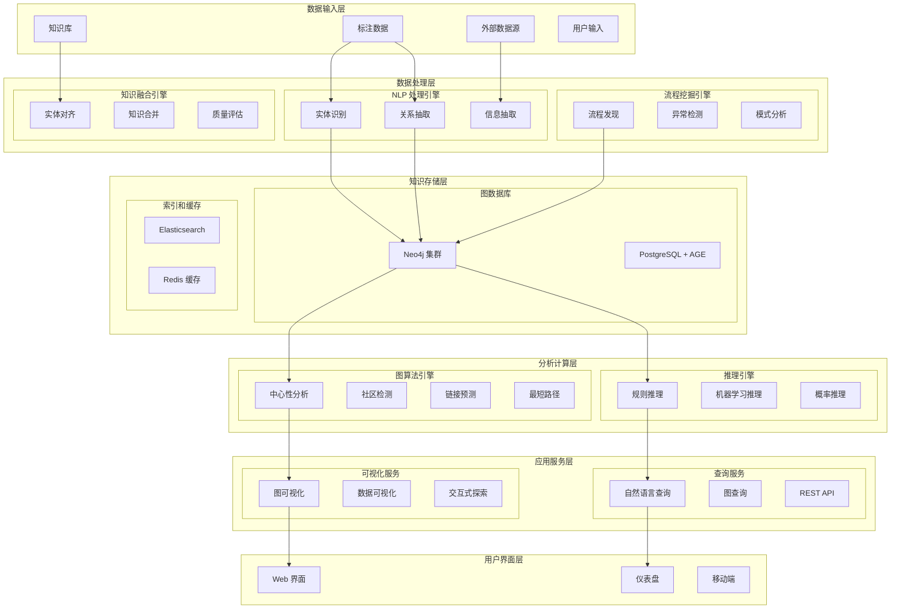

# 知识图谱集成系统 - 设计文档

## 概述

知识图谱集成系统基于问视间"织网"理念，为 SuperInsight 平台提供智能知识发现和关系分析能力。通过 AI 驱动的实体抽取、关系挖掘和隐性流程发现，构建领域知识图谱，实现数据的深度关联和智能推理。

## 架构设计

### 系统架构图



### 核心组件设计

#### 1. NLP 处理引擎

**实体识别模块:**
```python
from transformers import AutoTokenizer, AutoModelForTokenClassification
from transformers import pipeline
import spacy

class EntityExtractor:
    def __init__(self):
        # 加载预训练模型
        self.ner_pipeline = pipeline(
            "ner", 
            model="hfl/chinese-roberta-wwm-ext",
            tokenizer="hfl/chinese-roberta-wwm-ext",
            aggregation_strategy="simple"
        )
        
        # 加载 spaCy 模型
        self.nlp = spacy.load("zh_core_web_sm")
        
        # 自定义实体类型
        self.entity_types = {
            'PERSON': '人物',
            'ORG': '组织机构', 
            'LOC': '地点',
            'PRODUCT': '产品',
            'EVENT': '事件',
            'CONCEPT': '概念'
        }
    
    def extract_entities(self, text: str) -> List[Dict]:
        """提取文本中的实体"""
        # 使用 Transformer 模型
        transformer_entities = self.ner_pipeline(text)
        
        # 使用 spaCy 模型
        doc = self.nlp(text)
        spacy_entities = [
            {
                'text': ent.text,
                'label': ent.label_,
                'start': ent.start_char,
                'end': ent.end_char,
                'confidence': 0.9
            }
            for ent in doc.ents
        ]
        
        # 合并和去重
        entities = self.merge_entities(transformer_entities, spacy_entities)
        return self.normalize_entities(entities)
    
    def extract_custom_entities(self, text: str, domain_rules: Dict) -> List[Dict]:
        """基于领域规则提取自定义实体"""
        entities = []
        
        for entity_type, patterns in domain_rules.items():
            for pattern in patterns:
                matches = re.finditer(pattern, text)
                for match in matches:
                    entities.append({
                        'text': match.group(),
                        'label': entity_type,
                        'start': match.start(),
                        'end': match.end(),
                        'confidence': 0.8,
                        'source': 'rule_based'
                    })
        
        return entities
```

**关系抽取模块:**
```python
from transformers import AutoModel, AutoTokenizer
import torch
import torch.nn as nn

class RelationExtractor:
    def __init__(self):
        self.model_name = "hfl/chinese-roberta-wwm-ext"
        self.tokenizer = AutoTokenizer.from_pretrained(self.model_name)
        self.model = self.load_relation_model()
        
        # 预定义关系类型
        self.relation_types = {
            'PART_OF': '属于',
            'LOCATED_IN': '位于',
            'WORKS_FOR': '工作于',
            'FOUNDED_BY': '创立者',
            'CAUSES': '导致',
            'SIMILAR_TO': '相似于'
        }
    
    def extract_relations(self, text: str, entities: List[Dict]) -> List[Dict]:
        """从文本和实体中抽取关系"""
        relations = []
        
        # 遍历实体对
        for i, entity1 in enumerate(entities):
            for j, entity2 in enumerate(entities[i+1:], i+1):
                # 构造关系候选
                relation_candidate = {
                    'subject': entity1,
                    'object': entity2,
                    'context': text
                }
                
                # 预测关系类型和置信度
                relation_type, confidence = self.predict_relation(relation_candidate)
                
                if confidence > 0.5:  # 置信度阈值
                    relations.append({
                        'subject': entity1['text'],
                        'subject_type': entity1['label'],
                        'relation': relation_type,
                        'object': entity2['text'],
                        'object_type': entity2['label'],
                        'confidence': confidence,
                        'evidence': self.extract_evidence(text, entity1, entity2)
                    })
        
        return relations
    
    def predict_relation(self, candidate: Dict) -> Tuple[str, float]:
        """预测实体对之间的关系"""
        # 构造输入序列
        subject = candidate['subject']['text']
        object_text = candidate['object']['text']
        context = candidate['context']
        
        input_text = f"[CLS] {subject} [SEP] {object_text} [SEP] {context}"
        
        # 编码和预测
        inputs = self.tokenizer(input_text, return_tensors="pt", max_length=512, truncation=True)
        
        with torch.no_grad():
            outputs = self.model(**inputs)
            predictions = torch.softmax(outputs.logits, dim=-1)
            
        # 获取最高置信度的关系类型
        max_idx = torch.argmax(predictions, dim=-1).item()
        confidence = predictions[0][max_idx].item()
        
        relation_labels = list(self.relation_types.keys())
        relation_type = relation_labels[max_idx] if max_idx < len(relation_labels) else 'UNKNOWN'
        
        return relation_type, confidence
```

#### 2. 流程挖掘引擎

**隐性流程发现:**
```python
import networkx as nx
from pm4py import discover_petri_net_inductive
from pm4py.objects.log.importer.xes import importer as xes_importer
import pandas as pd

class ProcessMiner:
    def __init__(self):
        self.process_graph = nx.DiGraph()
        self.patterns = {}
        
    def discover_hidden_processes(self, annotation_data: List[Dict]) -> Dict:
        """从标注数据中发现隐性流程"""
        # 构建事件日志
        event_log = self.build_event_log(annotation_data)
        
        # 发现流程模型
        process_model = self.discover_process_model(event_log)
        
        # 识别异常模式
        anomalies = self.detect_anomalies(event_log, process_model)
        
        # 挖掘用户行为模式
        user_patterns = self.mine_user_patterns(annotation_data)
        
        return {
            'process_model': process_model,
            'anomalies': anomalies,
            'user_patterns': user_patterns,
            'statistics': self.calculate_statistics(event_log)
        }
    
    def build_event_log(self, annotation_data: List[Dict]) -> pd.DataFrame:
        """构建事件日志"""
        events = []
        
        for annotation in annotation_data:
            events.append({
                'case_id': annotation.get('task_id'),
                'activity': annotation.get('action', 'annotate'),
                'timestamp': annotation.get('created_at'),
                'user': annotation.get('user_id'),
                'resource': annotation.get('data_source'),
                'attributes': {
                    'quality_score': annotation.get('quality_score'),
                    'time_spent': annotation.get('time_spent'),
                    'difficulty': annotation.get('difficulty_level')
                }
            })
        
        return pd.DataFrame(events)
    
    def discover_process_model(self, event_log: pd.DataFrame) -> Dict:
        """发现流程模型"""
        # 转换为 PM4Py 格式
        log = self.convert_to_pm4py_log(event_log)
        
        # 使用归纳挖掘算法
        net, initial_marking, final_marking = discover_petri_net_inductive(log)
        
        # 构建流程图
        process_graph = self.build_process_graph(event_log)
        
        return {
            'petri_net': net,
            'initial_marking': initial_marking,
            'final_marking': final_marking,
            'process_graph': process_graph,
            'frequent_patterns': self.find_frequent_patterns(event_log)
        }
    
    def detect_anomalies(self, event_log: pd.DataFrame, process_model: Dict) -> List[Dict]:
        """检测异常模式"""
        anomalies = []
        
        # 时间异常检测
        time_anomalies = self.detect_time_anomalies(event_log)
        anomalies.extend(time_anomalies)
        
        # 序列异常检测
        sequence_anomalies = self.detect_sequence_anomalies(event_log, process_model)
        anomalies.extend(sequence_anomalies)
        
        # 质量异常检测
        quality_anomalies = self.detect_quality_anomalies(event_log)
        anomalies.extend(quality_anomalies)
        
        return anomalies
    
    def mine_user_patterns(self, annotation_data: List[Dict]) -> Dict:
        """挖掘用户行为模式"""
        user_patterns = {}
        
        # 按用户分组
        user_groups = {}
        for annotation in annotation_data:
            user_id = annotation.get('user_id')
            if user_id not in user_groups:
                user_groups[user_id] = []
            user_groups[user_id].append(annotation)
        
        # 分析每个用户的模式
        for user_id, user_data in user_groups.items():
            patterns = {
                'productivity': self.calculate_productivity(user_data),
                'quality_trend': self.analyze_quality_trend(user_data),
                'time_patterns': self.analyze_time_patterns(user_data),
                'preference': self.analyze_preferences(user_data)
            }
            user_patterns[user_id] = patterns
        
        return user_patterns
```

#### 3. 图数据库设计

**Neo4j 集成:**
```python
from neo4j import GraphDatabase
from typing import List, Dict, Any
import json

class Neo4jKnowledgeGraph:
    def __init__(self, uri: str, username: str, password: str):
        self.driver = GraphDatabase.driver(uri, auth=(username, password))
        
    def create_entity(self, entity: Dict) -> str:
        """创建实体节点"""
        with self.driver.session() as session:
            result = session.run(
                """
                CREATE (e:Entity {
                    id: $id,
                    name: $name,
                    type: $type,
                    properties: $properties,
                    created_at: datetime(),
                    confidence: $confidence
                })
                RETURN e.id as entity_id
                """,
                id=entity['id'],
                name=entity['name'],
                type=entity['type'],
                properties=json.dumps(entity.get('properties', {})),
                confidence=entity.get('confidence', 1.0)
            )
            return result.single()['entity_id']
    
    def create_relation(self, relation: Dict) -> str:
        """创建关系"""
        with self.driver.session() as session:
            result = session.run(
                """
                MATCH (s:Entity {id: $subject_id})
                MATCH (o:Entity {id: $object_id})
                CREATE (s)-[r:RELATION {
                    type: $relation_type,
                    properties: $properties,
                    confidence: $confidence,
                    created_at: datetime()
                }]->(o)
                RETURN id(r) as relation_id
                """,
                subject_id=relation['subject_id'],
                object_id=relation['object_id'],
                relation_type=relation['type'],
                properties=json.dumps(relation.get('properties', {})),
                confidence=relation.get('confidence', 1.0)
            )
            return result.single()['relation_id']
    
    def query_neighbors(self, entity_id: str, depth: int = 1) -> List[Dict]:
        """查询邻居节点"""
        with self.driver.session() as session:
            result = session.run(
                f"""
                MATCH (e:Entity {{id: $entity_id}})
                MATCH (e)-[r*1..{depth}]-(neighbor)
                RETURN neighbor, r
                """,
                entity_id=entity_id
            )
            
            neighbors = []
            for record in result:
                neighbor = dict(record['neighbor'])
                relations = [dict(rel) for rel in record['r']]
                neighbors.append({
                    'entity': neighbor,
                    'relations': relations
                })
            
            return neighbors
    
    def find_shortest_path(self, start_id: str, end_id: str) -> List[Dict]:
        """查找最短路径"""
        with self.driver.session() as session:
            result = session.run(
                """
                MATCH (start:Entity {id: $start_id})
                MATCH (end:Entity {id: $end_id})
                MATCH path = shortestPath((start)-[*]-(end))
                RETURN path
                """,
                start_id=start_id,
                end_id=end_id
            )
            
            paths = []
            for record in result:
                path = record['path']
                path_data = {
                    'nodes': [dict(node) for node in path.nodes],
                    'relationships': [dict(rel) for rel in path.relationships],
                    'length': len(path.relationships)
                }
                paths.append(path_data)
            
            return paths
```

#### 4. 智能查询引擎

**自然语言查询:**
```python
from transformers import pipeline, AutoTokenizer, AutoModel
import re
from typing import Dict, List

class NaturalLanguageQueryEngine:
    def __init__(self):
        # 加载语言模型
        self.nlp_pipeline = pipeline(
            "text2text-generation",
            model="ClueAI/ChatYuan-large-v2"
        )
        
        # 查询模板
        self.query_templates = {
            'find_entity': "MATCH (e:Entity) WHERE e.name CONTAINS '{entity}' RETURN e",
            'find_relation': "MATCH (s)-[r:{relation}]->(o) RETURN s, r, o",
            'find_path': "MATCH path = (s:Entity {{name: '{start}'}})-[*1..3]-(e:Entity {{name: '{end}'}}) RETURN path"
        }
        
        # 意图识别模式
        self.intent_patterns = {
            'find_entity': [r'找到|查找|搜索.*?实体', r'.*?是什么', r'.*?的信息'],
            'find_relation': [r'.*?关系', r'.*?连接', r'.*?相关'],
            'find_path': [r'.*?路径', r'.*?如何到达', r'.*?连通']
        }
    
    def parse_query(self, natural_query: str) -> Dict:
        """解析自然语言查询"""
        # 意图识别
        intent = self.identify_intent(natural_query)
        
        # 实体识别
        entities = self.extract_query_entities(natural_query)
        
        # 关系识别
        relations = self.extract_query_relations(natural_query)
        
        return {
            'intent': intent,
            'entities': entities,
            'relations': relations,
            'original_query': natural_query
        }
    
    def generate_cypher_query(self, parsed_query: Dict) -> str:
        """生成 Cypher 查询语句"""
        intent = parsed_query['intent']
        entities = parsed_query['entities']
        relations = parsed_query['relations']
        
        if intent == 'find_entity' and entities:
            entity_name = entities[0]['name']
            return self.query_templates['find_entity'].format(entity=entity_name)
        
        elif intent == 'find_relation' and relations:
            relation_type = relations[0]['type']
            return self.query_templates['find_relation'].format(relation=relation_type)
        
        elif intent == 'find_path' and len(entities) >= 2:
            start_entity = entities[0]['name']
            end_entity = entities[1]['name']
            return self.query_templates['find_path'].format(start=start_entity, end=end_entity)
        
        else:
            # 使用 LLM 生成复杂查询
            return self.generate_complex_query(parsed_query)
    
    def execute_query(self, cypher_query: str, kg_client) -> List[Dict]:
        """执行查询并返回结果"""
        try:
            results = kg_client.run_query(cypher_query)
            return self.format_results(results)
        except Exception as e:
            return {'error': str(e), 'query': cypher_query}
    
    def generate_explanation(self, query: str, results: List[Dict]) -> str:
        """生成查询结果的解释"""
        explanation_prompt = f"""
        用户查询: {query}
        查询结果: {results}
        
        请用自然语言解释这个查询结果，包括：
        1. 找到了什么实体或关系
        2. 这些结果的意义
        3. 可能的进一步探索方向
        """
        
        explanation = self.nlp_pipeline(explanation_prompt, max_length=200)[0]['generated_text']
        return explanation
```

## 数据模型

### 知识图谱核心模型

```python
from pydantic import BaseModel
from typing import List, Dict, Optional, Any
from datetime import datetime
from enum import Enum

class EntityType(str, Enum):
    PERSON = "PERSON"
    ORGANIZATION = "ORGANIZATION"
    LOCATION = "LOCATION"
    PRODUCT = "PRODUCT"
    EVENT = "EVENT"
    CONCEPT = "CONCEPT"

class RelationType(str, Enum):
    PART_OF = "PART_OF"
    LOCATED_IN = "LOCATED_IN"
    WORKS_FOR = "WORKS_FOR"
    CAUSES = "CAUSES"
    SIMILAR_TO = "SIMILAR_TO"

class Entity(BaseModel):
    id: str
    name: str
    type: EntityType
    properties: Dict[str, Any] = {}
    aliases: List[str] = []
    confidence: float = 1.0
    source: str = "extracted"
    created_at: datetime
    updated_at: Optional[datetime] = None

class Relation(BaseModel):
    id: str
    subject_id: str
    object_id: str
    type: RelationType
    properties: Dict[str, Any] = {}
    confidence: float = 1.0
    evidence: List[str] = []
    source: str = "extracted"
    created_at: datetime
    updated_at: Optional[datetime] = None

class KnowledgeGraph(BaseModel):
    id: str
    name: str
    description: str
    entities: List[Entity] = []
    relations: List[Relation] = []
    statistics: Dict[str, Any] = {}
    created_at: datetime
    updated_at: Optional[datetime] = None

class ProcessPattern(BaseModel):
    id: str
    name: str
    pattern_type: str  # sequence, parallel, choice, loop
    activities: List[str]
    frequency: int
    confidence: float
    discovered_from: str
    created_at: datetime

class UserBehaviorPattern(BaseModel):
    user_id: str
    pattern_type: str  # productivity, quality, time, preference
    pattern_data: Dict[str, Any]
    confidence: float
    time_period: Dict[str, datetime]
    created_at: datetime
```

### 查询和推理模型

```python
class QueryIntent(str, Enum):
    FIND_ENTITY = "find_entity"
    FIND_RELATION = "find_relation"
    FIND_PATH = "find_path"
    ANALYZE_PATTERN = "analyze_pattern"
    RECOMMEND = "recommend"

class NLQuery(BaseModel):
    id: str
    query_text: str
    intent: QueryIntent
    entities: List[str] = []
    relations: List[str] = []
    constraints: Dict[str, Any] = {}
    user_id: str
    created_at: datetime

class QueryResult(BaseModel):
    query_id: str
    results: List[Dict[str, Any]]
    explanation: str
    confidence: float
    execution_time: float
    cypher_query: Optional[str] = None
    created_at: datetime

class InferenceRule(BaseModel):
    id: str
    name: str
    rule_type: str  # logical, statistical, ml_based
    conditions: List[Dict[str, Any]]
    conclusions: List[Dict[str, Any]]
    confidence_threshold: float = 0.5
    enabled: bool = True
    created_at: datetime
```

## 正确性属性

*正确性属性是系统必须满足的形式化规范，通过属性测试验证系统行为的正确性。*

### 属性 1: 实体抽取一致性
*对于任何* 输入文本，相同的实体在多次抽取中应保持一致的标识和属性
**验证: 需求 2.1, 2.2**

### 属性 2: 关系抽取对称性
*对于任何* 对称关系类型，如果存在 A→B 的关系，则应能推断出 B→A 的对应关系
**验证: 需求 2.2, 5.2**

### 属性 3: 图查询结果完整性
*对于任何* 图查询操作，返回的结果应包含所有满足条件的节点和边
**验证: 需求 1.3, 5.1**

### 属性 4: 流程挖掘时序一致性
*对于任何* 事件序列，挖掘出的流程模型应保持时间顺序的一致性
**验证: 需求 3.1, 3.2**

### 属性 5: 知识融合无冲突性
*对于任何* 知识融合操作，合并后的知识图谱不应包含逻辑冲突
**验证: 需求 6.2, 7.3**

### 属性 6: 推理结果可解释性
*对于任何* 推理查询，系统应能提供完整的推理路径和证据链
**验证: 需求 5.4, 5.5**

### 属性 7: 图算法收敛性
*对于任何* 迭代图算法，在有限步骤内应收敛到稳定结果
**验证: 需求 8.1, 8.2**

### 属性 8: 增量更新一致性
*对于任何* 增量更新操作，更新后的图谱应与批量重建的结果保持一致
**验证: 需求 6.1, 6.4**

## 错误处理

### 数据质量错误
- **实体识别错误**: 置信度评估和人工审核机制
- **关系抽取错误**: 多模型投票和证据验证
- **数据冲突**: 冲突检测和解决策略

### 查询执行错误
- **查询语法错误**: 自动修正和建议
- **性能超时**: 查询优化和分页处理
- **结果为空**: 相关推荐和查询扩展

### 系统运行错误
- **图数据库连接失败**: 自动重连和故障转移
- **内存不足**: 流式处理和外存算法
- **并发冲突**: 事务管理和锁机制

## 测试策略

### 单元测试
- 实体和关系抽取算法
- 图查询和遍历算法
- 流程挖掘算法
- 自然语言查询解析

### 集成测试
- 端到端知识图谱构建
- 多数据源知识融合
- 查询引擎集成测试
- 可视化界面测试

### 性能测试
- 大规模图数据处理
- 复杂查询响应时间
- 并发访问压力测试
- 内存和存储使用效率

### 属性测试
- 使用 Hypothesis 生成随机实体和关系测试抽取一致性
- 模拟各种查询模式测试结果完整性
- 验证推理算法的逻辑正确性
- 测试增量更新的数据一致性

每个属性测试运行最少 100 次迭代，确保在各种输入条件下系统行为的正确性。