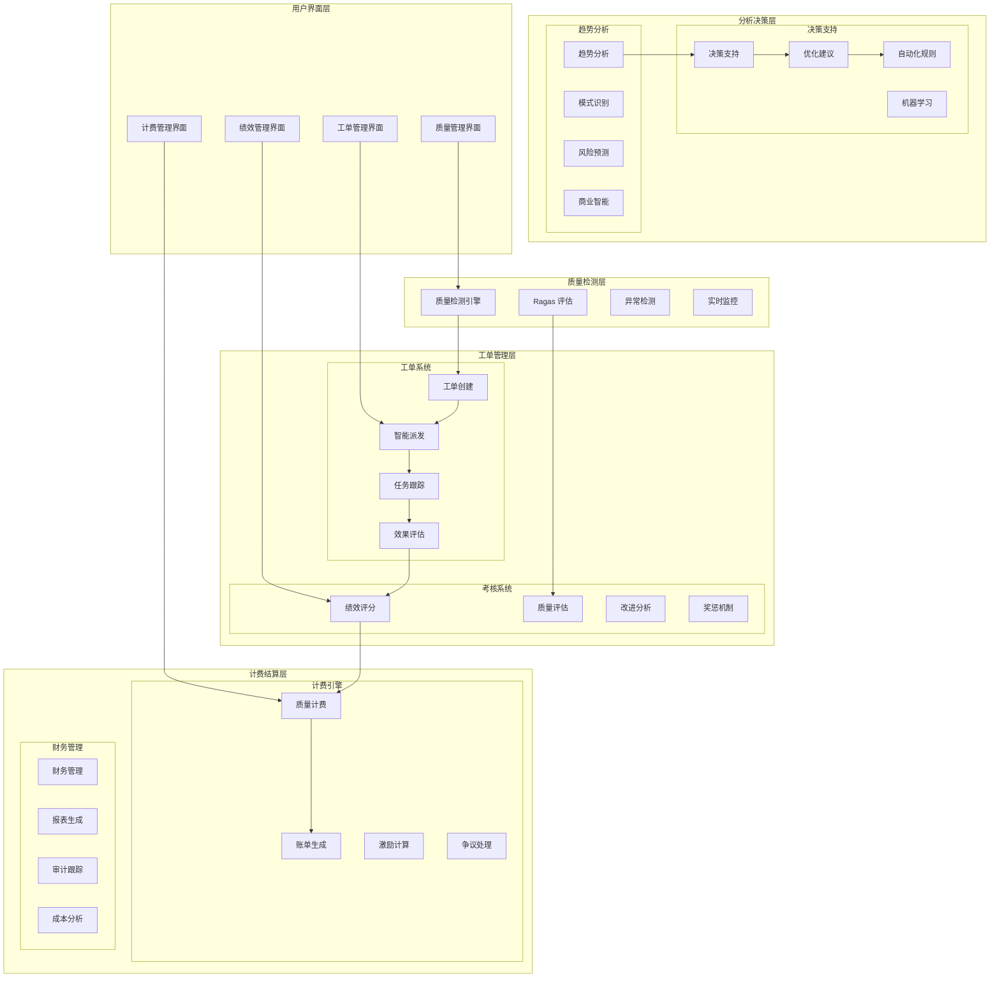

# 质量计费闭环系统 - 设计文档

## 概述

质量计费闭环系统构建完整的质量管理生态，通过智能工单派发、修复效果考核、Ragas 质量评估和精准计费机制，实现质量驱动的业务闭环，确保标注质量的持续改进和公平计费。

## 架构设计

### 系统架构图



### 核心组件设计

#### 1. 智能工单派发系统

**工单创建和分类:**
```python
from enum import Enum
from typing import List, Dict, Optional
import numpy as np
from sklearn.cluster import KMeans

class TicketPriority(str, Enum):
    LOW = "low"
    MEDIUM = "medium"
    HIGH = "high"
    URGENT = "urgent"

class TicketType(str, Enum):
    ACCURACY_ISSUE = "accuracy_issue"
    CONSISTENCY_ISSUE = "consistency_issue"
    COMPLETENESS_ISSUE = "completeness_issue"
    FORMAT_ISSUE = "format_issue"
    GUIDELINE_VIOLATION = "guideline_violation"

class IntelligentTicketDispatcher:
    def __init__(self):
        self.skill_matrix = {}  # 人员技能矩阵
        self.workload_tracker = {}  # 工作负载跟踪
        self.performance_history = {}  # 历史绩效
        
    def create_ticket(self, quality_issue: Dict) -> Dict:
        """创建质量问题工单"""
        # 问题分类
        ticket_type = self.classify_issue(quality_issue)
        
        # 优先级评估
        priority = self.assess_priority(quality_issue)
        
        # 影响范围分析
        impact_scope = self.analyze_impact(quality_issue)
        
        ticket = {
            'id': self.generate_ticket_id(),
            'type': ticket_type,
            'priority': priority,
            'description': quality_issue['description'],
            'affected_data': quality_issue['data_ids'],
            'impact_scope': impact_scope,
            'created_at': datetime.now(),
            'sla_deadline': self.calculate_sla_deadline(priority),
            'status': 'created'
        }
        
        return ticket
    
    def dispatch_ticket(self, ticket: Dict) -> str:
        """智能派发工单"""
        # 获取候选处理人员
        candidates = self.get_qualified_candidates(ticket)
        
        # 计算最优分配
        best_assignee = self.calculate_optimal_assignment(ticket, candidates)
        
        # 更新工作负载
        self.update_workload(best_assignee, ticket)
        
        # 发送通知
        self.send_notification(best_assignee, ticket)
        
        return best_assignee
    
    def calculate_optimal_assignment(self, ticket: Dict, candidates: List[str]) -> str:
        """计算最优工单分配"""
        scores = {}
        
        for candidate in candidates:
            # 技能匹配度
            skill_score = self.calculate_skill_match(candidate, ticket['type'])
            
            # 工作负载
            workload_score = self.calculate_workload_score(candidate)
            
            # 历史绩效
            performance_score = self.get_performance_score(candidate, ticket['type'])
            
            # 综合评分
            total_score = (
                skill_score * 0.4 +
                workload_score * 0.3 +
                performance_score * 0.3
            )
            
            scores[candidate] = total_score
        
        # 返回得分最高的候选人
        return max(scores, key=scores.get)
    
    def monitor_sla_compliance(self):
        """监控 SLA 合规性"""
        overdue_tickets = self.get_overdue_tickets()
        
        for ticket in overdue_tickets:
            # 自动升级
            self.escalate_ticket(ticket)
            
            # 重新分配
            if ticket['escalation_count'] >= 2:
                new_assignee = self.reassign_ticket(ticket)
                self.notify_escalation(ticket, new_assignee)
```

#### 2. 修复效果考核系统

**绩效评估和考核:**
```python
import pandas as pd
from datetime import datetime, timedelta

class PerformanceEvaluationSystem:
    def __init__(self):
        self.evaluation_weights = {
            'quality_improvement': 0.4,
            'resolution_speed': 0.3,
            'customer_satisfaction': 0.2,
            'innovation': 0.1
        }
        
    def evaluate_fix_quality(self, ticket_id: str, fix_data: Dict) -> Dict:
        """评估修复质量"""
        # 获取修复前后的质量数据
        before_quality = self.get_quality_before_fix(ticket_id)
        after_quality = self.get_quality_after_fix(ticket_id)
        
        # 计算质量改进度
        improvement_rate = self.calculate_improvement_rate(before_quality, after_quality)
        
        # 评估修复完整性
        completeness_score = self.assess_fix_completeness(fix_data)
        
        # 检查是否引入新问题
        regression_penalty = self.check_regression_issues(ticket_id)
        
        quality_score = (
            improvement_rate * 0.5 +
            completeness_score * 0.3 -
            regression_penalty * 0.2
        )
        
        return {
            'quality_score': max(0, min(100, quality_score)),
            'improvement_rate': improvement_rate,
            'completeness_score': completeness_score,
            'regression_penalty': regression_penalty
        }
    
    def calculate_performance_score(self, user_id: str, period: str = 'monthly') -> Dict:
        """计算绩效分数"""
        # 获取评估期间的工单数据
        tickets = self.get_user_tickets(user_id, period)
        
        if not tickets:
            return {'score': 0, 'details': {}}
        
        # 质量改进评分
        quality_scores = [self.evaluate_fix_quality(t['id'], t['fix_data'])['quality_score'] 
                         for t in tickets if t['status'] == 'resolved']
        quality_improvement = np.mean(quality_scores) if quality_scores else 0
        
        # 解决速度评分
        resolution_times = [self.calculate_resolution_time(t) for t in tickets 
                           if t['status'] == 'resolved']
        speed_score = self.calculate_speed_score(resolution_times)
        
        # 客户满意度评分
        satisfaction_scores = [t.get('customer_rating', 0) for t in tickets 
                              if t.get('customer_rating')]
        customer_satisfaction = np.mean(satisfaction_scores) if satisfaction_scores else 0
        
        # 创新评分
        innovation_score = self.calculate_innovation_score(user_id, tickets)
        
        # 综合评分
        total_score = (
            quality_improvement * self.evaluation_weights['quality_improvement'] +
            speed_score * self.evaluation_weights['resolution_speed'] +
            customer_satisfaction * self.evaluation_weights['customer_satisfaction'] +
            innovation_score * self.evaluation_weights['innovation']
        )
        
        return {
            'total_score': total_score,
            'quality_improvement': quality_improvement,
            'resolution_speed': speed_score,
            'customer_satisfaction': customer_satisfaction,
            'innovation': innovation_score,
            'tickets_handled': len(tickets),
            'resolution_rate': len([t for t in tickets if t['status'] == 'resolved']) / len(tickets)
        }
    
    def generate_performance_report(self, user_id: str, period: str) -> Dict:
        """生成绩效报告"""
        performance = self.calculate_performance_score(user_id, period)
        
        # 获取同期团队平均水平
        team_average = self.get_team_average_performance(period)
        
        # 生成改进建议
        improvement_suggestions = self.generate_improvement_suggestions(performance, team_average)
        
        # 计算排名
        ranking = self.calculate_user_ranking(user_id, period)
        
        return {
            'user_id': user_id,
            'period': period,
            'performance': performance,
            'team_comparison': {
                'user_score': performance['total_score'],
                'team_average': team_average,
                'percentile': ranking['percentile']
            },
            'improvement_suggestions': improvement_suggestions,
            'achievements': self.identify_achievements(performance),
            'generated_at': datetime.now()
        }
```

#### 3. Ragas 质量评估集成

**RAG 系统质量评估:**
```python
from ragas import evaluate
from ragas.metrics import faithfulness, answer_relevancy, context_precision, context_recall
import pandas as pd

class RagasQualityEvaluator:
    def __init__(self):
        self.metrics = [faithfulness, answer_relevancy, context_precision, context_recall]
        self.evaluation_history = []
        
    def evaluate_rag_quality(self, dataset: pd.DataFrame) -> Dict:
        """评估 RAG 系统质量"""
        # 使用 Ragas 进行评估
        result = evaluate(
            dataset=dataset,
            metrics=self.metrics
        )
        
        # 计算综合质量分数
        quality_score = self.calculate_composite_score(result)
        
        # 分析质量趋势
        trend_analysis = self.analyze_quality_trend(result)
        
        # 生成改进建议
        improvement_suggestions = self.generate_rag_improvements(result)
        
        evaluation_result = {
            'timestamp': datetime.now(),
            'metrics': {
                'faithfulness': result['faithfulness'],
                'answer_relevancy': result['answer_relevancy'],
                'context_precision': result['context_precision'],
                'context_recall': result['context_recall']
            },
            'composite_score': quality_score,
            'trend_analysis': trend_analysis,
            'improvement_suggestions': improvement_suggestions
        }
        
        # 保存评估历史
        self.evaluation_history.append(evaluation_result)
        
        return evaluation_result
    
    def calculate_composite_score(self, ragas_result: Dict) -> float:
        """计算综合质量分数"""
        weights = {
            'faithfulness': 0.3,
            'answer_relevancy': 0.3,
            'context_precision': 0.2,
            'context_recall': 0.2
        }
        
        composite_score = sum(
            ragas_result[metric] * weight 
            for metric, weight in weights.items()
        )
        
        return composite_score
    
    def analyze_quality_trend(self, current_result: Dict) -> Dict:
        """分析质量趋势"""
        if len(self.evaluation_history) < 2:
            return {'trend': 'insufficient_data'}
        
        # 获取历史数据
        recent_scores = [eval_result['composite_score'] 
                        for eval_result in self.evaluation_history[-5:]]
        
        # 计算趋势
        if len(recent_scores) >= 3:
            trend_slope = np.polyfit(range(len(recent_scores)), recent_scores, 1)[0]
            
            if trend_slope > 0.01:
                trend = 'improving'
            elif trend_slope < -0.01:
                trend = 'declining'
            else:
                trend = 'stable'
        else:
            trend = 'insufficient_data'
        
        return {
            'trend': trend,
            'slope': trend_slope if 'trend_slope' in locals() else 0,
            'recent_scores': recent_scores,
            'volatility': np.std(recent_scores) if len(recent_scores) > 1 else 0
        }
    
    def generate_rag_improvements(self, ragas_result: Dict) -> List[str]:
        """生成 RAG 改进建议"""
        suggestions = []
        
        # 基于各项指标给出建议
        if ragas_result['faithfulness'] < 0.8:
            suggestions.append("提高回答的忠实度：检查生成内容是否严格基于检索到的上下文")
            suggestions.append("优化提示词模板，强调基于事实回答")
        
        if ragas_result['answer_relevancy'] < 0.8:
            suggestions.append("提高回答相关性：优化检索算法，确保检索到的内容与问题高度相关")
            suggestions.append("调整生成模型参数，提高回答的针对性")
        
        if ragas_result['context_precision'] < 0.8:
            suggestions.append("提高上下文精确度：优化检索排序算法")
            suggestions.append("增加负样本训练，提高检索精确度")
        
        if ragas_result['context_recall'] < 0.8:
            suggestions.append("提高上下文召回率：扩大检索范围或调整检索策略")
            suggestions.append("增加知识库内容，确保覆盖更多相关信息")
        
        return suggestions
```