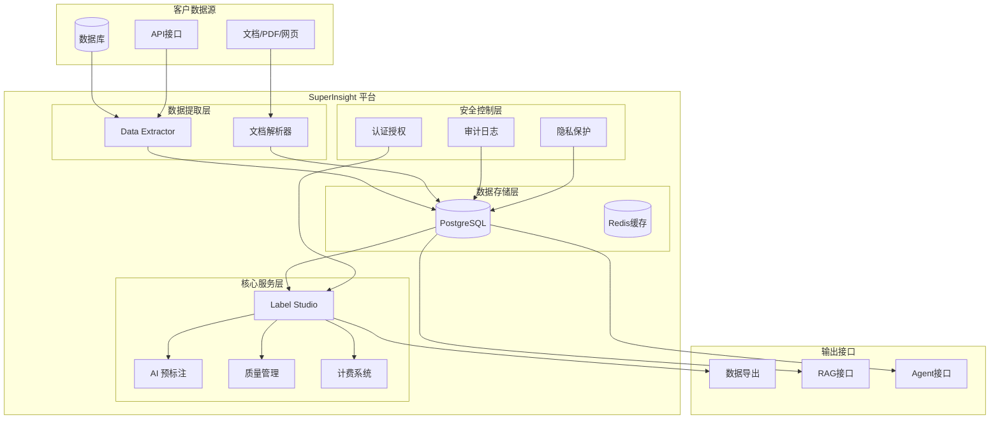
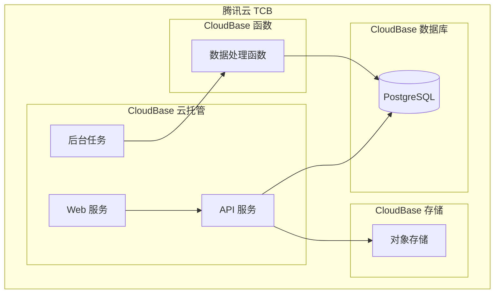
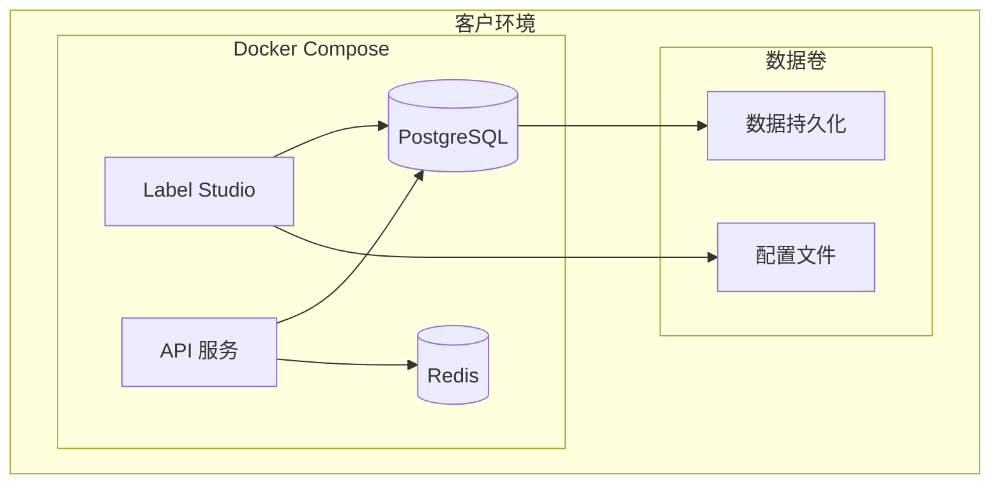

# SuperInsight AI 数据治理与标注平台 - 设计文档

## 概述

SuperInsight 平台采用极简开源架构，以 Label Studio 为核心标注引擎，PostgreSQL 为统一数据存储，构建企业级 AI 语料治理与标注平台。平台支持腾讯云 TCB 云托管、纯私有化和混合云三种部署模式，实现"标注即治理 + 按量计费"的商业闭环。

## 架构设计

### 整体架构



### 部署架构

#### 1. TCB 云托管部署（优先）



#### 2. 私有化部署



## 组件和接口

### 1. 数据提取模块 (Data Extractor)

**职责**: 安全只读提取各种数据源的语料数据

**接口设计**:
```python
class DataExtractor:
    def extract_from_database(self, connection_config: DatabaseConfig) -> List[Document]
    def extract_from_files(self, file_paths: List[str]) -> List[Document]
    def extract_from_api(self, api_config: APIConfig) -> List[Document]
    def validate_connection(self, config: ConnectionConfig) -> bool
```

**安全特性**:
- 只读数据库连接
- 加密传输协议 (TLS/SSL)
- IP 白名单访问控制
- 连接超时和重试机制

### 2. Label Studio 核心引擎

**职责**: 提供标注界面和工作流管理

**集成接口**:
```python
class LabelStudioIntegration:
    def create_project(self, project_config: ProjectConfig) -> Project
    def import_tasks(self, project_id: str, tasks: List[Task]) -> ImportResult
    def export_annotations(self, project_id: str, format: str) -> ExportResult
    def setup_webhooks(self, project_id: str, webhook_urls: List[str]) -> bool
    def configure_ml_backend(self, project_id: str, ml_config: MLConfig) -> bool
```

**扩展功能**:
- 自定义标注模板
- 工作流状态管理
- 质量检查集成
- 计费统计集成

### 3. AI 预标注服务

**职责**: 提供智能预标注功能

**接口设计**:
```python
class AIAnnotator:
    def predict(self, task: Task, model_config: ModelConfig) -> Prediction
    def batch_predict(self, tasks: List[Task], model_config: ModelConfig) -> List[Prediction]
    def get_confidence_score(self, prediction: Prediction) -> float
    def update_model(self, training_data: List[Annotation]) -> ModelUpdateResult
```

**支持的模型**:
- Ollama 本地模型集成
- HuggingFace Transformers
- 自定义模型接口
- 模型版本管理

### 4. 质量管理模块

**职责**: 语义质量评估和工单管理

**接口设计**:
```python
class QualityManager:
    def evaluate_quality(self, annotations: List[Annotation]) -> QualityReport
    def create_quality_issue(self, issue: QualityIssue) -> WorkOrder
    def assign_work_order(self, order_id: str, assignee: User) -> bool
    def resolve_issue(self, order_id: str, resolution: Resolution) -> bool
```

**质量评估指标**:
- Ragas 语义评估框架
- 标注一致性检查
- 覆盖率统计
- 专家审核评分

### 5. 计费结算系统

**职责**: 工时统计和成本计算

**接口设计**:
```python
class BillingSystem:
    def track_annotation_time(self, user_id: str, task_id: str, duration: int) -> bool
    def calculate_monthly_bill(self, tenant_id: str, month: str) -> Bill
    def generate_report(self, tenant_id: str, period: DateRange) -> BillingReport
    def export_billing_data(self, tenant_id: str, format: str) -> ExportResult
```

**计费模式**:
- 按标注条数计费
- 按工时计费
- 按项目包年计费
- 混合计费模式

## 数据模型

### 核心数据结构

```python
# 文档模型
class Document:
    id: str
    source_type: str  # database, file, api
    source_config: dict
    content: str
    metadata: dict
    created_at: datetime
    updated_at: datetime

# 标注任务模型
class Task:
    id: str
    document_id: str
    project_id: str
    status: str  # pending, in_progress, completed, reviewed
    annotations: List[Annotation]
    ai_predictions: List[Prediction]
    quality_score: float
    created_at: datetime

# 标注结果模型
class Annotation:
    id: str
    task_id: str
    annotator_id: str
    annotation_data: dict
    confidence: float
    time_spent: int  # seconds
    created_at: datetime

# 质量工单模型
class QualityIssue:
    id: str
    task_id: str
    issue_type: str
    description: str
    severity: str
    status: str
    assignee_id: str
    created_at: datetime
    resolved_at: datetime
```

### PostgreSQL 数据库设计

```sql
-- 文档表
CREATE TABLE documents (
    id UUID PRIMARY KEY DEFAULT gen_random_uuid(),
    source_type VARCHAR(50) NOT NULL,
    source_config JSONB NOT NULL,
    content TEXT NOT NULL,
    metadata JSONB DEFAULT '{}',
    created_at TIMESTAMP DEFAULT NOW(),
    updated_at TIMESTAMP DEFAULT NOW()
);

-- 创建 GIN 索引优化 JSONB 查询
CREATE INDEX idx_documents_metadata ON documents USING GIN (metadata);
CREATE INDEX idx_documents_source_config ON documents USING GIN (source_config);

-- 标注任务表
CREATE TABLE tasks (
    id UUID PRIMARY KEY DEFAULT gen_random_uuid(),
    document_id UUID REFERENCES documents(id),
    project_id VARCHAR(100) NOT NULL,
    status VARCHAR(20) DEFAULT 'pending',
    annotations JSONB DEFAULT '[]',
    ai_predictions JSONB DEFAULT '[]',
    quality_score FLOAT DEFAULT 0.0,
    created_at TIMESTAMP DEFAULT NOW()
);

-- 计费记录表
CREATE TABLE billing_records (
    id UUID PRIMARY KEY DEFAULT gen_random_uuid(),
    tenant_id VARCHAR(100) NOT NULL,
    user_id VARCHAR(100) NOT NULL,
    task_id UUID REFERENCES tasks(id),
    annotation_count INTEGER DEFAULT 0,
    time_spent INTEGER DEFAULT 0,
    cost DECIMAL(10,2) DEFAULT 0.00,
    billing_date DATE DEFAULT CURRENT_DATE
);

-- 质量工单表
CREATE TABLE quality_issues (
    id UUID PRIMARY KEY DEFAULT gen_random_uuid(),
    task_id UUID REFERENCES tasks(id),
    issue_type VARCHAR(50) NOT NULL,
    description TEXT,
    severity VARCHAR(20) DEFAULT 'medium',
    status VARCHAR(20) DEFAULT 'open',
    assignee_id VARCHAR(100),
    created_at TIMESTAMP DEFAULT NOW(),
    resolved_at TIMESTAMP
);
```

## 错误处理

### 错误分类和处理策略

1. **数据提取错误**
   - 连接超时: 自动重试 3 次，指数退避
   - 权限错误: 记录日志，通知管理员
   - 数据格式错误: 跳过错误记录，继续处理

2. **标注服务错误**
   - Label Studio 服务不可用: 降级到离线模式
   - AI 预标注失败: 回退到人工标注
   - 存储错误: 本地缓存，延迟同步

3. **质量检查错误**
   - 评估服务超时: 使用默认质量分数
   - 规则引擎错误: 记录异常，人工审核
   - 工单系统错误: 邮件通知备份

4. **计费系统错误**
   - 计费数据丢失: 从审计日志恢复
   - 结算错误: 暂停计费，人工核查
   - 报表生成失败: 异步重试机制

### 错误恢复机制

```python
class ErrorHandler:
    def handle_extraction_error(self, error: ExtractionError) -> RecoveryAction
    def handle_annotation_error(self, error: AnnotationError) -> RecoveryAction
    def handle_quality_error(self, error: QualityError) -> RecoveryAction
    def handle_billing_error(self, error: BillingError) -> RecoveryAction
    
    def log_error(self, error: Exception, context: dict) -> None
    def notify_admin(self, error: CriticalError) -> None
    def trigger_recovery(self, recovery_action: RecoveryAction) -> bool
```

## 测试策略

### 单元测试

**测试范围**:
- 数据提取模块的各种数据源连接
- AI 预标注的模型推理逻辑
- 质量评估算法的准确性
- 计费计算的正确性
- 安全控制的权限验证

**测试工具**:
- pytest 作为测试框架
- pytest-mock 用于模拟外部依赖
- pytest-cov 用于代码覆盖率统计

### 属性测试

**测试库**: Hypothesis (Python)

**测试配置**: 每个属性测试运行最少 100 次迭代

**属性测试用例**:

#### 属性 1: 数据提取幂等性
*对于任何*有效的数据源配置，多次提取相同数据应该产生相同的结果
**验证: 需求 1.1, 1.5**

#### 属性 2: 标注数据完整性
*对于任何*标注任务，保存后再读取的标注数据应该与原始数据完全一致
**验证: 需求 3.4**

#### 属性 3: 质量评分单调性
*对于任何*标注结果，增加正确标注的数量应该不会降低整体质量评分
**验证: 需求 4.4**

#### 属性 4: 计费累加性
*对于任何*用户在任何时间段内的标注工作，总计费应该等于各个任务计费的累加
**验证: 需求 7.1, 7.2**

#### 属性 5: 权限传递性
*对于任何*用户权限设置，如果用户 A 有权限访问项目 P，且项目 P 包含任务 T，则用户 A 应该有权限访问任务 T
**验证: 需求 8.5**

#### 属性 6: 数据导出一致性
*对于任何*标注项目，导出后再导入的数据应该与原始项目数据保持一致
**验证: 需求 6.1, 6.2, 6.3**

#### 属性 7: AI 预标注置信度范围
*对于任何*AI 预标注结果，置信度分数应该在 0.0 到 1.0 之间
**验证: 需求 10.5**

#### 属性 8: 多租户数据隔离
*对于任何*两个不同的租户，一个租户不应该能够访问另一个租户的任何数据
**验证: 需求 7.4, 8.1**

### 集成测试

**测试场景**:
- Label Studio 与 PostgreSQL 的数据同步
- AI 预标注与人工标注的协作流程
- 质量工单的完整生命周期
- 多部署模式的功能一致性

**测试环境**:
- Docker Compose 测试环境
- 模拟的腾讯云 TCB 环境
- 真实的 Label Studio 实例

### 性能测试

**测试指标**:
- 数据提取吞吐量: > 1000 文档/分钟
- 标注界面响应时间: < 2 秒
- 批量导出性能: > 10000 条记录/分钟
- 并发用户支持: > 100 用户同时在线

**测试工具**:
- Locust 用于负载测试
- PostgreSQL 性能监控
- Label Studio 性能分析